# ETL Project

## Group Members:

(1) Hiu Lai   
(2) Navid Motlagh   
(3) Tu Cam Dang   
(4) Wei Wen Tan   
(5) Chris Burley   

## Task Components:

The ETL project that you are currently viewing comprises the following key components:

a) This ReadMe file, a document which:
    
    - Outlines the groups' key objectives. 
    - Explains each key step that the group undertook throughout the project.
    - Showcases the group's findings.

b) ETL.ipynb, a jupiter file which:

    - Reads the source data.
    - Transforms the source data to orderly, clean and useable dataframes.
    - Exports the cleaned data to a 'relational' database in Postgres.

c) Schemata.sql, a document which:

    - Builds tables withing the relational database in Postgres.
    - Established primary keys.

d) An 'images' folder, which contains scatterplots comparing:

    - A country's cost of living (including and not including rent) versus its GDP
    - A country's birthrate versus its GDP
    - A country's deathrate versus its GDP
    - A country's literacy rate versus its GDP
    - A country's infant mortality rate versus its GDP

e) A 'resources' folder, which contains the raw data.

    - Cost_of_Living_Index_2022.csv
    - countries of the world.csv

## Key objectives:

In completing this ETL project, our group sought to explore the relationship between a country's GDP and its birthrate, deathrate, cost of living, literacy rate and infant mortality rate. We wanted to see whether the strength of a nation's economy was linked to higher quality of life for its people, and if so, how strong the link was.

We also sought to improve our extracting, transforming and loading skills. We committed to working collaboratively for as many of the task's technical elements as possible so that each of us could engage with ALL of the coding. Working this way also meant that we could develop our practice by observing the work of others within the team when they had more refined skills in a certain area. We avoided, for as long as was reasonable, splitting the task into discrete components and sending individuals off with a tightly defined roles that no-one else would be involved in completing. The purpose of this project, afterall, was to learn.

## Data Sources:

We started by brainstorming relationships that we wanted to explore.
Once we had established a wishlist of sorts, we visited Kaggle.com to determine whether data sets existed for the variables in the aforementioned relationships.
We were pleased to find that data sets DID exist.

    - Cost_of_Living_Index_2022.csv
    - countries of the world.csv

We promptly downloaded them and began designing a relational database to house the data.

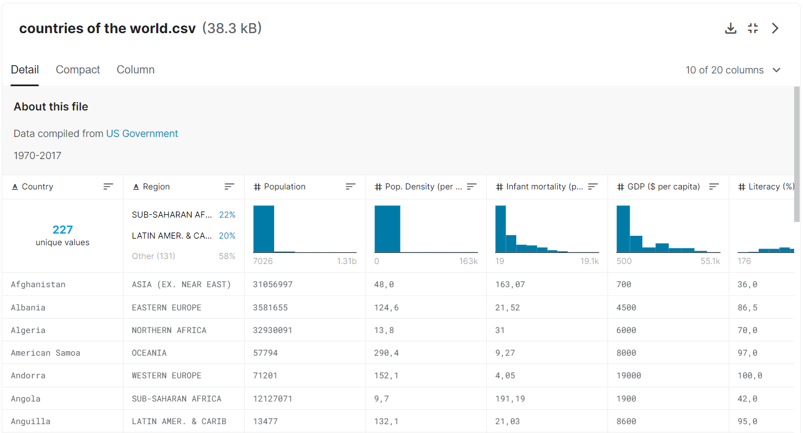 
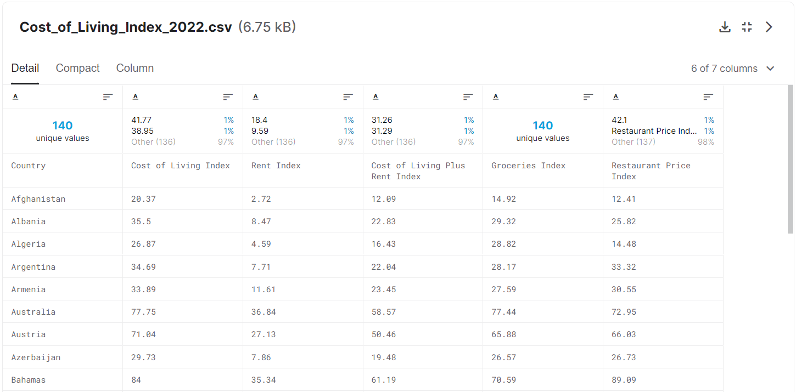

## Relational Database:

We chose to use Postgres as our relational database for loading our cleaned data into.
A database named CountriesDB was created.
We wrote a Schemata document, which established two tables in the database. The first was called 'countries' and the second, 'cost_of_Living'.
We listed each of the column headers for the tables, as well as the variable type that would be housed beneath them.
A Primary Key was assigned to each table, and in both cases it was 'Country'. The idea was that we would eventually join the two tables on 'Country' and write queries relating to the amalgamated data.

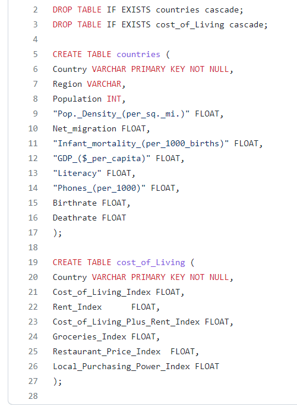

## Data Formatting:

The following process was undertaken on BOTH csv files outlined earlier.
For the purpose of this README file, we will show you how the 'countries of the world' data was formatted and cleaned.

(1) Import dependencies.

(2) Import the csv data to jupiter and create a Pandas dataframe:

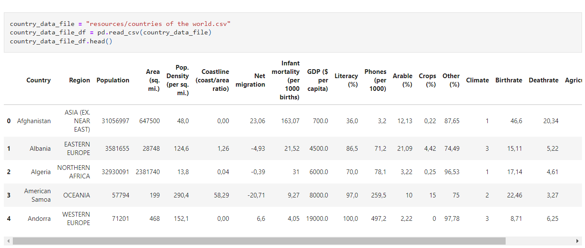

(3) Choose the columns within the dataframe to display:

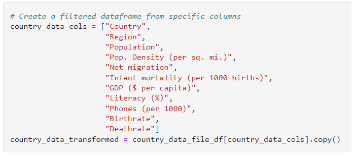

(4) Remove all spaces from the column headers and replace them with underscores. We also dropped all percentage symbols.

(This was necessary because spaces and other special characters in the columns causes errors in the Postgres schemata.)

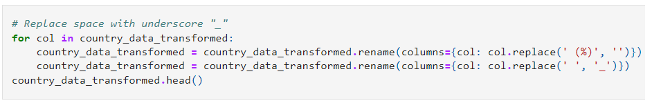

(5) Convert all country names to a format that removes 'the', any unnecessary spaces and any special characters. Also ensure that the first letter is capitalised, but all remaining letters in the name are lower-case. The program also changed lesser known region names to more commonly recognised ones.

(This was necessary because we intended to join our Postgres tables based on 'Country'. A mismatch in formatting or name style would lead to errors, so uniformity was important.)

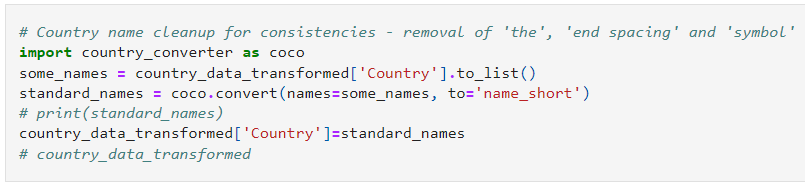

(6) Convert decimal numbers in the data which are expressed using European conventions (commas) to digits with a full-stop for the decimal point. 

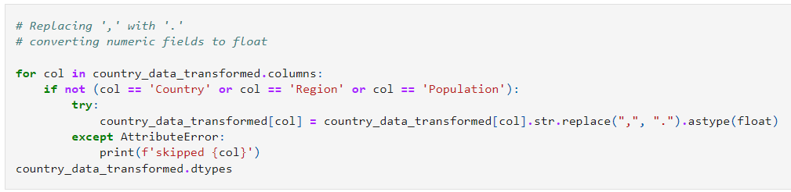

## Connection and loading to Postgres:

A connection was then made between the Jupyter notebook and the Postgres database established earlier.
This would allow the transfer of the cleaned table data.

A config.py was created to store passwords.
It was listed in a gitignore file so that it would not be uploaded to github.

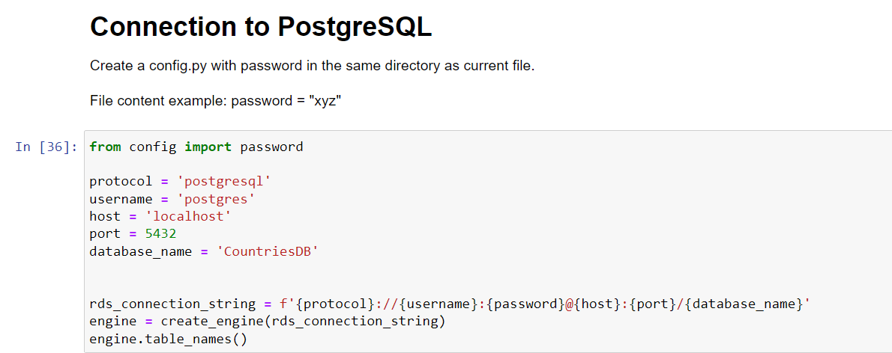
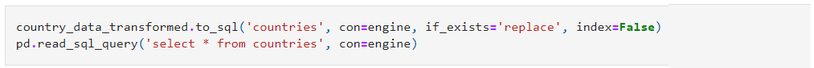

## Transformations:

An SQL query was then written to join the two tables in the Postgres database.

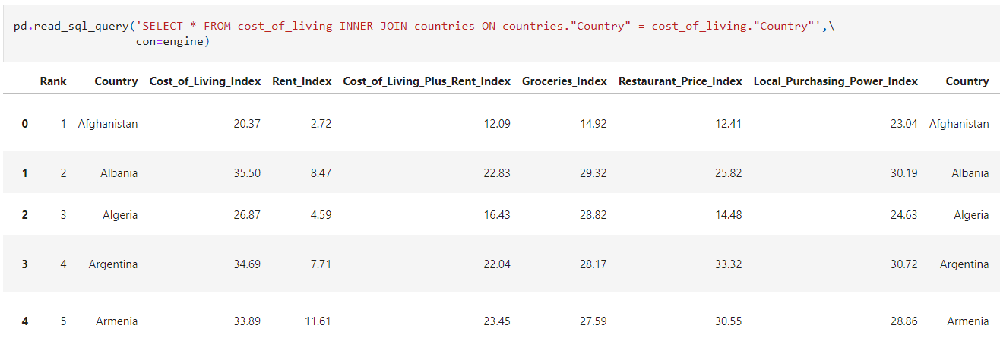

Further SQL queries were written to isolate the pairs of variables that the group set out to explore the relationship between.

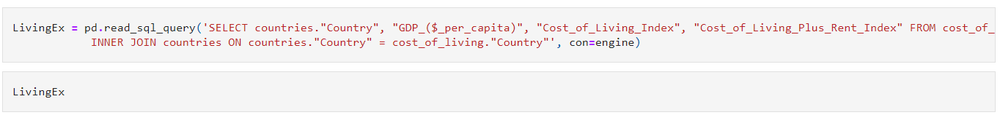

MatPlotLib was used to create scatterplots for:

    - A country's cost of living (including and not including rent) versus its GDP
    - A country's birthrate versus its GDP
    - A country's deathrate versus its GDP
    - A country's literacy rate versus its GDP
    - A country's infant mortality rate versus its GDP

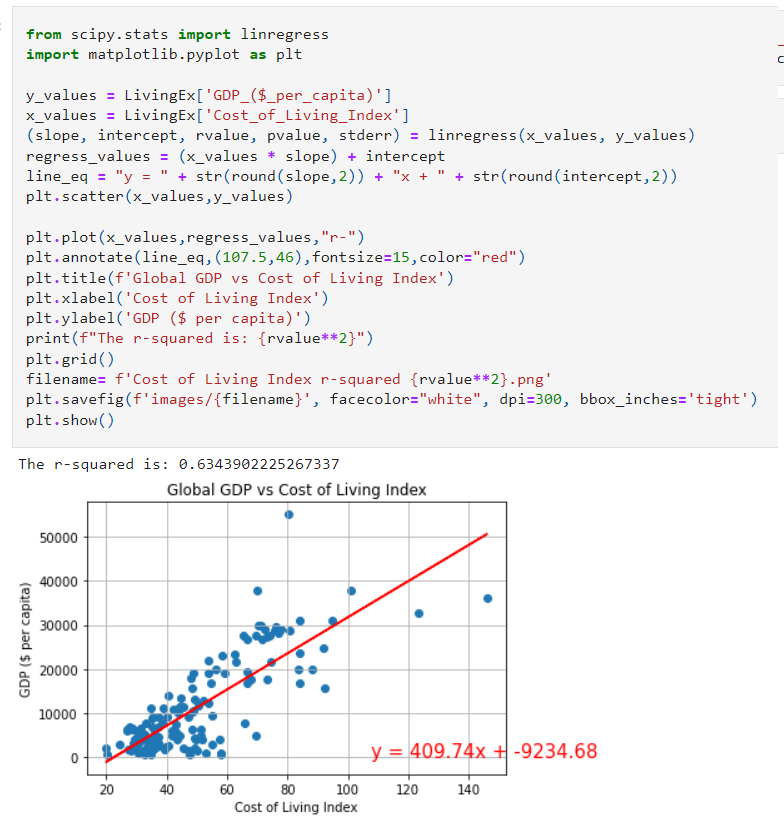

Lastly, SQL queries were written to rank each country on each of the variables listed immediately above.
Below is a screen capture showing the literacy rankings.

We then created a master CSV showing how the countries ranked in terms of each variable.

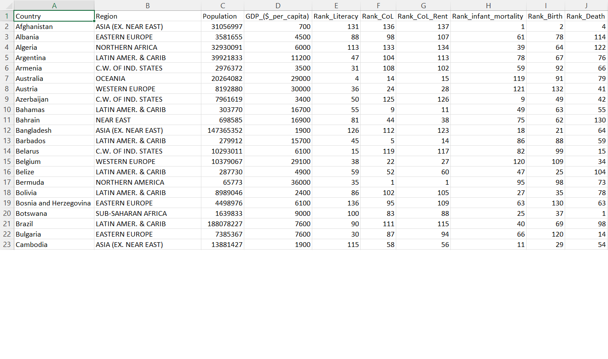

## Findings - Literacy versus GDP:

Introduction

GDP is one the most important factors in literacy rate. Government expenditure in education (a function of GDP) and foreign direct investments and openness to trade(contributing factors to GDP) have positive relationships with literacy rates. This means that as the GDP per capita grows so does the literacy rate and vice versa.

Insight 1

As is demonstrated in the graph below, there is a positive non-linear relationship between GDP(per capita) and literacy rate.
It can be concluded that higher GDP would result in higher literacy rate. Therefore, to achieve a higher literacy rate, governments can take proper initiatives such as consistent increase in the education sector share of the budget, making primary/secondary education compulsory and developing educational infrastructures. 

These measures will lead to growth in GDP per capita, and ultimately resulting in overall development of the country.

Insight 2

It can be observed, as is expected due to the exponential (non-linear) regression between GDP and Literacy rate, that the behaviour of the graph changes. At a certain point, GDP growth accelerates whereas there is minimal change in literacy rate.
This can be due to the fact that although literacy rate is an influential factor in GDP growth, it is only one of many. In fact, even though literacy rate is vital to GDP, other factors start to gain significant importance at a certain point, namely good governance, democratic indexes, political, economic and social freedoms, openness to trade and foreign direct investment.

To conclude, this analysis suggests that, along with investment in education, governments pursue political, economic and social development, enhance democratic indexes, and absorb foreign investments to increase GDP.

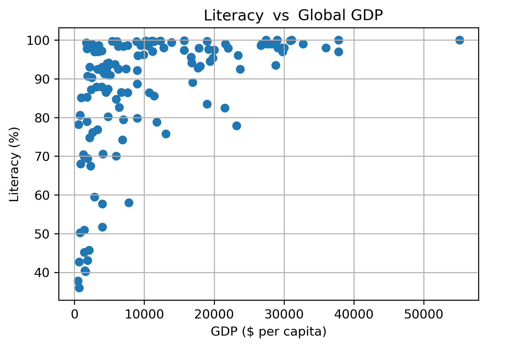

## Findings - Infant Mortality Rate vs GDP:

Based on the graph below, there is an indication of a negative gradient, which explains that for every $1 increase in the GDP, it would lead to a decrease in the expected value of the Infant Mortality Rate of the country by 0.0016 deaths per 1000 births, ceteris paribus.
This indicates that when the country has a higher GDP, the infant mortality rate is considerably lower and vice versa.
The graph indicates that the majority of the countries have an infant mortality rate that lies in between the range of 0 to 40 deaths per 1000 births. These depend on a variety of conditions including living standards and conditions, birth issues and many more.

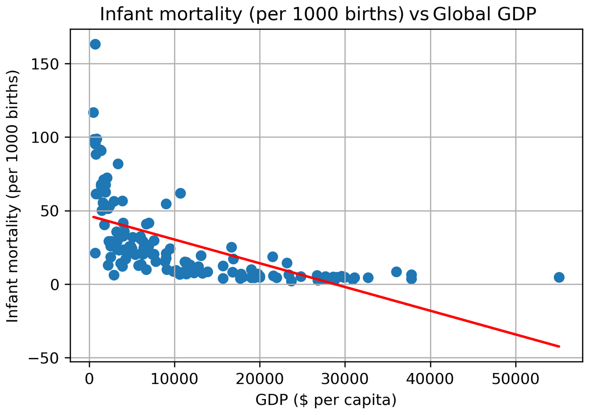

## Findings - Death Rate vs GDP:

We can observe from the graph that there is a negative gradient, which indicates that the GDP would decrease if the death rate were to increase.
We can also observe from the graph that the death rate of most of the countries involved lie between 5-10 percent. This could be due to global disease pandemics like AIDS and COVID-19, which affected many countries.
Some of the countries have a high death rate as a result of low GDP. This could be the case because of the issues that some of these countries are facing, including famine, lack of safe drinking water and water-borne diseases (diarrhoea, typhoid, hookworm and schistosomiasis), sanitation issues, showing the effect and evidence of the negative trend.

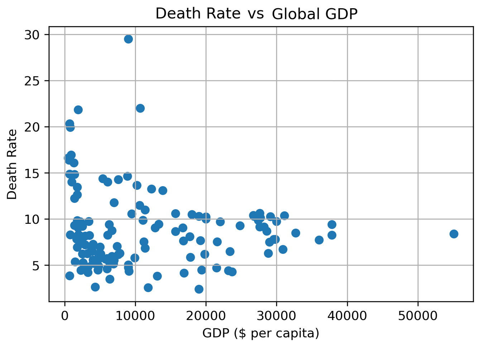

## Findings - Birth Rate vs GDP:

We can observe from the graph that there is a negative gradient, which indicates that the GDP would decrease if the birth rate were to increase.
High GDP countries would have more commitments to deal with, compared to those with lower GDP levels, like work and educational commitments and other factors like markets, financial concerns and social security.

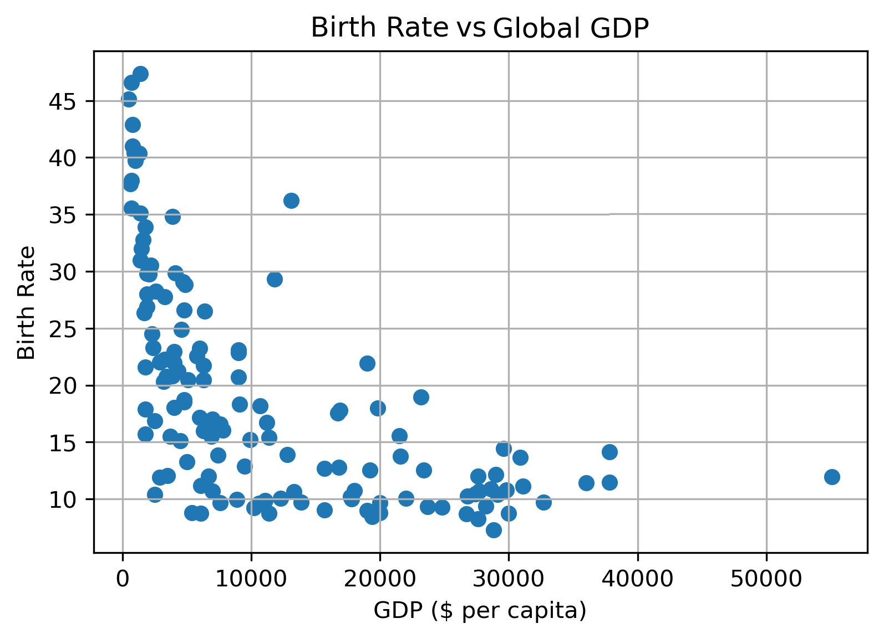

## Findings - Cost of Living vs GDP:

There is a difference between cost of living and standard of living. The cost of living is used to measure how a common person can afford their regular needs to survive in that city. It is linked to the wages. There is a higher price associated with living closer to the city. Wages are often higher to compensate for that fact.
In contrast, the standard of living refers to the level of money and well-being, that people enjoy in a particular country. It is related to the quality of life.
We found that there is a moderate correlation between Global GDP and with cost of living index in many countries. The high level of GDP relates to the high level of living cost index.
The level of GDP measures economic growth, this might relate to inflation. Inflation increases the cost of living i.e. the employees' wages rise. Generally, the high level of GDP indicates the a growing economy and impacts on the standard of living as well as other factors.

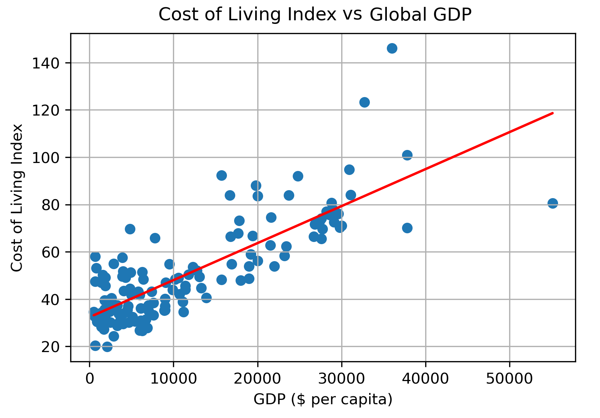

